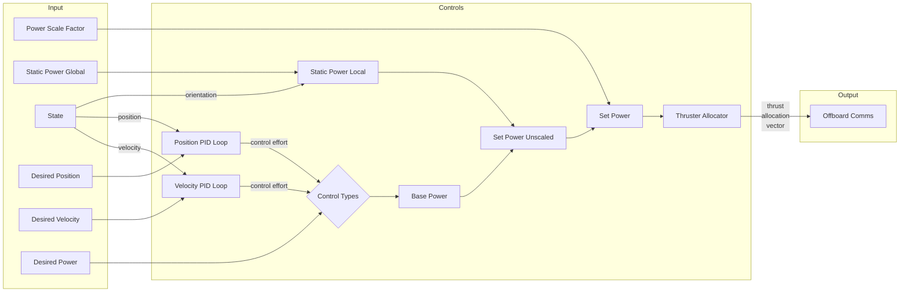

# Controls

## Overview
The controls package is responsible for taking in current [state](#state) and [desired state](#desired-state) messages and outputting a [thrust allocation vector](#thrust-allocation-vector) to achieve that desired state.

It accepts [desired position](#desired-position), [desired velocity](#desired-velocity), and [desired power](#desired-power) as inputs. If desired position and velocity are provided, the system will use [PID loops](#pid-loop) to compute the [power](#power) needed along each [axis](#axis) to move the robot to the desired position and/or velocity. If desired power is provided, the system will use the desired power directly.

Once the system obtains the power needed along each axis, the [thruster allocator](#thrust-allocation) will compute the amount of force each thruster needs to exert to achieve that power, and outputs the thrust allocation vector.

The system can be enabled and disabled, meaning it will start and stop publishing thruster allocations. Disabling the system acts as a software emergency stop.

The system supports mixing and matching [control types](#control-types), whereby different forms of desired state inputs can be used for different axes. For example, if desired velocity is used for x, y, and z, and, at the same time, desired position is used for roll, pitch, and yaw, the robot will move with the given linear velocity while keeping a fixed orientation.

The system also supports applying [static power](#static-power-global) – a fixed amount of power, regardless of the desired state, added to the power applied along the linear axes. This is useful for counteracting constant external forces such as buoyancy or water currents.

PID constants and static power can be tuned on the fly, without needing to restart the system.

## Contents
1. [Flow](#flow)
2. [Basic Usage](#basic-usage)
3. [Structure](#structure)
    1. [Directory Structure](#directory-structure)
    2. [Code Structure](#code-structure)
4. [Config](#config)
    1. [Robot Config File](#robot-config-file)
    2. [CSV Files](#csv-files)
    3. [Launch Config](#launch-config)
5. [Dependencies](#dependencies)
    1. [ROS](#ros)
    2. [ROS Messages](#ros-messages)
    3. [Non-ROS C++](#non-ros-c)
    4. [Non-ROS Python](#non-ros-python)
6. [Tuning](#tuning)
    1. [Tuning PID](#tuning-pid)
    2. [Tuning Static Power Global](#tuning-static-power-global)
    3. [Tuning Power Scale Factor](#tuning-power-scale-factor)
7. [Topics](#topics)
    1. [Subscribed](#subscribed)
    2. [Published](#published)
8. [Services](#services)
    1. [Advertised](#advertised)
    2. [Called](#called)
9. [Development](#development)
    1. [Modifying Dependencies](#modifying-dependencies)
    2. [Compiling](#compiling)
    3. [Debugging](#debugging)
    4. [Structural Principles](#structural-principles)
    5. [On-the-Fly Parameter Updates](#on-the-fly-parameter-updates)
10. [Appendix](#appendix)

## Flow

This diagram shows the flow of information between the different parts of the system. It is not comprehensive, but it gives a high-level visualization of how the system works.

The system takes in the current [state](#state) of the robot, [desired position](#desired-position), [velocity](#desired-velocity), [power](#desired-power), [static power global](#static-power-global), and [power scale factor](#power-scale-factor). It then uses [PID loops](#pid-loop) to compute the power needed along each axis to move the robot to the desired position and/or velocity. Based on the [control types](#control-types), it combines the outputs of the PID loops and desired power to get the [base power](#base-power). It sums the base power and [static power local](#static-power-local) to compute the [set power unscaled](#set-power-unscaled), which is multiplied by the power scale factor to obtain the [set power](#set-power). The [thruster allocator](#thrust-allocation) then computes the amount of force each thruster needs to exert to achieve the set power. It outputs the [thrust allocation vector](#thrust-allocation-vector), which is sent to the offboard comms package, which spins the thrusters accordingly.

## Basic Usage
Ensure that the robot's current [state](#state) is being published to the `/state` topic and a transformation from the `odom` frame to the `base_link` frame is being published to the `/tf` topic. Both of these are done by the sensor fusion package.

Launch the controls node by running:
```bash
roslaunch controls controls.launch
```

To make the robot move to a [desired state](#desired-state), do the following in the given order and in quick succession:
1. Call the `/controls/reset_pid_loops` service to [reset the PID loops](#pid-reset).
2. Publish desired state.
    1. Publish desired position (if any) to the `/controls/desired_position` topic.
    2. Publish desired velocity (if any) to the `/controls/desired_velocity` topic.
    3. Publish desired power (if any) to the `/controls/desired_power` topic.
2. Call the `/controls/set_control_types` service to set the [control types](#control-types) for each axis, if they are different from current control types (as published to the `/controls/control_types` topic).
3. If not already enabled, enable controls by publishing `true` to the `/controls/enabled` topic.

Controls will now publish the [thrust allocation vector](#thrust-allocation-vector) to the `/controls/thruster_allocs` topic, and the robot will move to the desired state.

> [!IMPORTANT]
> To check if the robot has moved to the desired state, check if the current state is close to the desired state. Do _not_ check the position or velocity errors published to the `/controls/position_error` and `/controls/velocity_error` topics, as there may be a delay between the time the desired state is published and the time the errors are updated.

To stop the robot, disable controls by publishing `false` to the `/controls/enabled` topic.

If the new desired state is not significantly different from the current desired state, the PID loops do _not_ need to be reset. For example, if the robot is moving towards an object detected with CV, and the estimated position of the object changes slightly, the PID loops do _not_ need to be reset. However, if the robot is moving towards an object and then starts moving towards a different object, the PID loops _do_ need to be reset.

## Structure
### Directory Structure
The directory structure of the controls package is as follows:

#### Config
The `config` directory contains the [robot config files](#robot-config-file), which are YAML files that contain configuration information for this system that is unique for each robot.

#### Data
The `data` directory contains [CSV files](#csv-files) for the [wrench matrices](#wrench-matrix) and the [wrench matrices' pseudoinverces](#wrench-matrix-pseudoinverse). These are used by the [thruster allocator](#thruster-allocator) to compute the [thrust allocation vector](#thrust-allocation-vector).

#### Include
The `include` directory contains C++ header files. These are used to define the classes and functions used in the system. See the [Code Structure](#code-structure) section for more details.

#### Launch
The `launch` directory contains ROS launch files. These are used to start the system. See the [Launch Config](#launch-config) section for more details.

#### Scripts
The `scripts` directory contains Python scripts. See the [Code Structure](#code-structure) section for more details.

#### Src
The `src` directory contains C++ source files. These are used to define the classes and functions used in the system. See the [Code Structure](#code-structure) section for more details.

#### CMakeLists.txt
The `CMakeLists.txt` file is used to define the build process for the system. It is used by the `catkin build` command to compile the system.

#### Package.xml
The `package.xml` file is used to define the package's dependencies and other metadata. It is used by the `catkin build` command to compile the system.

#### README.md
The `README.md` file is used to provide documentation for the package. It is used by developers to understand how the package works.


### Code Structure
The code is split into the following files:

#### controls_types.h
This file defines varius enums, constants, and structs used throughout the system.

#### drc_pid.h/drc_pid.cpp
This file defines the `PID` class, which implements a [PID controller](#pid-controller). It takes in the error between the [setpoint](#setpoint) and the robot's current [state](#state) and computes the [control effort](#control-effort).

#### pid_manager.h/pid_manager.cpp
This file defines the `PIDManager` class, which implements a [PID loop](#pid-loop) containing six [PID controllers](#pid-controller). It takes in the difference between [desired state](#desired-state) and the robot's current [state](#state) and computes the [control effort](#control-effort) needed along each [axis](#axis) to move the robot to the desired state.

#### thruster_allocator.h/thruster_allocator.cpp
This file defines the `ThrusterAllocator` class, which performs [thrust allocation](#thrust-allocation). It computes the amount of force each thruster needs to exert to achieve a given [set power](#set-power).

#### controls_utils.h/controls_utils.cpp
This file defines the `ControlsUtils` namespace, which includes various helper functions used throughout the system.

#### controls.h/controls.cpp
This file defines the `Controls` class, as well as the `main` function. It takes in the current [state](#state) and [desired state](#desired-state) and outputs a [thrust allocation vector](#thrust-allocation-vector) to achieve that state. It handles all interfaces with ROS, including publishing, subscribing, and advertising. It contains the code that drives the system, calling the other classes and functions as needed.

> [!IMPORTANT]
> The `Controls` class is the _only_ class that interfaces with ROS. Thus, this package creates only one node: `controls`.
>
> All other classes use pure C++ and do not depend on ROS, with the following exceptions:
> - All classes use `ROS_ASSERT_MSG`, `ROS_ERROR`, and `ROS_WARN` to log errors and warnings and throw exceptions.
> - Some functions in `ControlsUtils` work with ROS messages.
> - Some enums in `controls_types.h` get their values from ROS messages.

#### compute_wrench_matrix.py
This is a Python script that computes the [wrench matrix](#wrench-matrix) and its [pseudoinverse](#wrench-matrix-pseudoinverse) for a given robot, given the thruster configuration in the [robot config file](#robot-config-file). It is used to generate the [CSV files](#csv-files) in the `data` directory.

It performs all computations symbolically using the [SymPy](https://www.sympy.org) library, and only converts the results to numerical values at the end. This is done to ensure that the computations are as accurate as possible.

#### comp_2023.py
This is a Python script that contains the task planning code used at RoboSub 2023. _This file has been kept for reference purposes only and is not actively maintained._

#### controls_utils.py
This is a Python script that contains various helper functions used exclusively by the `comp_2023.py` script. _This file has been kept for reference purposes only and is not actively maintained._

## Config

### Robot Config File
The robot config file is a YAML file that contains configuration information for this system that is unique for each robot. One config file is required for each robot. They are located in the `config` directory. They should be named `<robot_name>.yaml`, where `<robot_name>` is the value of the `$ROBOT_NAME` environment variable associated with the robot.

The robot config file contains the following fields:
```yaml
pid:
  position:
    x:
      Kp: <float>
      Ki: <float>
      Kd: <float>
      Ff: <float>
      control_effort:
        min: <float>
        max: <float>
      derivative_type: <0 or 1>
      error_ramp_rate: <float>
    y:
      ...
    z:
      ...
    roll:
      ...
    pitch:
      ...
    yaw:
      ...
  position_cascaded:
    x:
      ...
    y:
      ...
    z:
      ...
    roll:
      ...
    pitch:
      ...
    yaw:
      ...
  velocity:
    x:
      ...
    y:
      ...
    z:
      ...
    roll:
      ...
    pitch:
      ...
    yaw:
      ...
desired_power_limits:
  x:
    min: <float>
    max: <float>
  y:
    ...
  z:
    ...
  roll:
    ...
  pitch:
    ...
  yaw:
    ...
static_power_global:
  x: <float>
  y: <float>
  z: <float>
thrusters:
  - name: <string>
    type: <string>
    pos: [<float>, <float>, <float>] # x, y, z in meters
    rpy: [<float>, <float>, <float>] # roll, pitch, yaw in degrees
    flipped: <bool>
  - ...
wrench_matrix_file_path: <string>
wrench_matrix_pseudoinverse_file_path: <string>
```

The `pid` field contains the [PID gains](#pid-gains) and other PID configuration for the system. It contains subfields for each type of [PID loop](#pid-loop): `position`, `position_cascaded`, and `velocity`. Each of these subfields contains subfields for each [axis](#axis) that the system can control: `x`, `y`, `z`, `roll`, `pitch`, and `yaw`. Each of these subfields contains further subfields for the PID gains – `Kp`, `Ki`, `Kd`, `Ff` – and other PID configuration for that combination of axis and PID loop, including the [`control_effort: min` and `control_effort: max`](#control-effort-limits), [`derivative type`](#derivative-type), and [`error ramp rate`](#error-ramp-rate). The `control_effort: min` must be less than or equal to `control_effort: max`.

The [`desired_power_limits`](#desired-power-limits) field contains the minimum and maximum [desired power](#desired-power) that can be used for each axis. It contains subfields for each axis: `x`, `y`, `z`, `roll`, `pitch`, and `yaw`. Each of these subfields contains subfields `min` and `max` for the minimum and maximum desired power, respectively. The minimum desired power must be less than or equal to the maximum desired power.

The [`static_power_global`](#static-power-global) field contains the amount of power that should be added to the power applied along the linear axes. It contains subfields `x`, `y`, and `z` for the amount of power to be added along the x, y, and z axes, respectively.

The `thrusters` field contains information about each thruster. From top to bottom, the thrusters in this file should be in the _same order that is expected by offboard comms,_ in the `allocs` part of the `custom_msgs/ThrusterAllocs` message. Each thruster config contains the following subfields:
- `name`: The uniquely identifying  name of the thruster. Not used by the system; included for human use only.
- `type`: The thruster's model type, such as T200. Not used by the system; included for human use only.
- `pos`: The position of the thruster in the `base_link` frame. In other words, the position of the thruster relative to the robot's center of mass. The x, y, and z coordinates are given in that order in meters.
- `rpy`: The orientation of the thruster in the `base_link` frame, using extrinsic Euler angles. The rotations are performed specified in the order: roll, pitch, yaw. They are also given in that order in degrees. For example:
    - An orientation of `[0, 0, 0]` means when the thruster is commanded to exert positive power, it will push the robot in the positive x direction.
    - An orientation of `[0, 0, 180]` means the thruster is rotated 180 degrees around the z axis, so when the thruster is commanded to exert positive power, it will push the robot in the negative x direction.
    - An orientation of `[0, 90, 0]` means the thruster is rotated 90 degrees around the y axis, so when the thruster is commanded to exert positive power, it will push the robot in the positive z direction.
    > [!NOTE]
    > Specifying a non-zero roll will not affect the direction the thruster pushes the robot in. This is because relative to itself, the force exerted by the thruster is always in the positive x direction. Thus, rotation about the x axis does not affect the axis of thrust.
- `flipped`: Whether the thruster is flipped. This is used to account for ESCs that are wired in reverse. If `true`, when the thruster is commanded to exert positive power, it will push the robot in the direction opposite to what is expected based on its orientation.
    > [!IMPORTANT]
    > This should be the _only_ place in the _entire codebase_ where flipped thrusters are accounted for.

The `wrench_matrix_file_path` and `wrench_matrix_pseudoinverse_file_path` fields contain the paths to the [CSV files](#csv-files) containing the [wrench matrix](#wrench-matrix) and its [pseudoinverse](#wrench-matrix-pseudoinverse), respectively. These files are used by the [thruster allocator](#thruster-allocator) to compute the [thrust allocation vector](#thrust-allocation-vector). They should be unique for each robot. They should be specified relative to the directory of this package. They should not contain a leading `/`. For example, if the CSV files are in the `data` directory, the paths should be `data/wrench_matrix.csv` and `data/wrench_matrix_pseudoinverse.csv`.


### CSV Files
The `data` directory contains [CSV files](#csv-files) for all robots' [wrench matrices](#wrench-matrix) and their [pseudoinverses](#wrench-matrix-pseudoinverse). These are used by the [thruster allocator](#thruster-allocator) to compute the [thrust allocation vector](#thrust-allocation-vector).

One pair of CSV files is required for each robot. They should be located in the `data` directory. The files are generated automatically by the `compute_wrench_matrix.py` script. The script will output the CSV files to the paths specified in the [robot config file](#robot-config-file) and they will be read by the system at those paths.

> [!IMPORTANT]
> The CSV files should be _regenerated_ whenever the thruster configuration changes. This includes adding, removing, repositioning, or reorienting thrusters.
>
> Additionally, the CSV files should _not_ contain any leading or trailing whitespace, column or row headers, and the values should be separated by commas.
>
> Finally, do not manually edit the files. They are generated automatically by the `compute_wrench_matrix.py` script.

### Launch Config
The `launch` directory contains the following launch files:
- `controls.launch`: Primary launch file for the system.
- `controls_gdb.launch`: Launch file for debugging the system with GDB.
- `controls_valgrind.launch`: Launch file for debugging the system with Valgrind.

Each of these launch files contains the following parameters:
- `sim`: Whether the system is being run in simulation or not. _Currently, this parameter is not used by the system,_ but it may be used in the future.
- `enable_position_pid`: Whether the position PID loop is enabled or not. If `false`, the system will not run the position PID loop and setting a [desired position](#desired-position) will have no affect on the system. If `true`, the system will use the position PID loop to compute the [control efforts](#control-effort) needed to move the robot to the desired position.
- `enable_velocity_pid`: Whether the velocity PID loop is enabled or not. If `false`, the system will not run the velocity PID loop and setting a [desired velocity](#desired-velocity) will have no affect on the system. If `true`, the system will use the velocity PID loop to compute the control efforts needed to move the robot to the desired velocity.
- `cascaded_pid`: Whether the position PID loop is [cascaded](#cascaded-position-pid-loop) or not. If `true`, the system will use the control efforts output by the position PID loop as the [setpoints](#setpoint) for the velocity PID loop. If `false`, the system will use the control efforts output by the position PID loop to compute the [base power](#base-power) directly.
    > [!NOTE]
    > If `cascaded_pid` is `true`, then both `enable_position_pid` and `enable_velocity_pid` must also be `true` for the robot to move to the desired position, as both position and velocity PID loops are required to move the robot to the desired position when they are cascaded.

## Dependencies
### ROS
- [resource_retriever](http://wiki.ros.org/resource_retriever): A ROS package that provides C++ and Python interfaces for retrieving data from URLs. It is used by the system to read and write the [robot config files](#robot-config-file) and [CSV files](#csv-files).
- [roscpp](http://wiki.ros.org/roscpp): The C++ client library for ROS. It is used by the system to interface with ROS.
- [roslib](http://wiki.ros.org/roslib): The core library for ROS. It is used by the system to interface with ROS.
- [rospy](http://wiki.ros.org/rospy): The Python client library for ROS. It is used by the Python scripts to interface with ROS.
- [tf](http://wiki.ros.org/tf): The first version of the ROS transformation library. It is used by the `comp_2023.py` script to transform between different frames.
- [tf2_ros](http://wiki.ros.org/tf2): The second version of the ROS transformation library. It is used by the system to transform between different frames.

### ROS Messages
- custom_msgs: Custom ROS messages used by the system. These are defined in the `custom_msgs` package in the `core` workspace.
- [geometry_msgs](http://wiki.ros.org/geometry_msgs): ROS messages for geometric primitives such as points, vectors, and poses.
- [nav_msgs](http://wiki.ros.org/nav_msgs): ROS messages for navigation-related data such as odometry, paths, and maps.
- [std_msgs](http://wiki.ros.org/std_msgs): ROS messages for common data types such as strings, floats, and integers.
- [std_srvs](http://wiki.ros.org/std_srvs): ROS services for common data types such as booleans and empty requests.

### Non-ROS C++
- [Eigen3](https://eigen.tuxfamily.org): A C++ library for linear algebra. It is used by the system to perform matrix operations.
- [OSQP](https://osqp.org): A C library for solving [quadratic programming](#quadratic-programming) problems. It is used by the [thruster allocator](#thruster-allocator) to compute the [thrust allocation vector](#thrust-allocation-vector).
- [OSQP-Eigen](https://robotology.github.io/osqp-eigen): A C++ wrapper for OSQP. It is used by the system to interface with OSQP.
- [yaml-cpp](https://github.com/jbeder/yaml-cpp): A C++ library for parsing YAML files. It is used by the system to parse the [robot config files](#robot-config-file).

### Non-ROS Python
- [NumPy](https://numpy.org): A Python library for numerical computing. It is used by the `compute_wrench_matrix.py` script to perform matrix operations.
- [Pandas](https://pandas.pydata.org): A Python library for data manipulation and analysis. It is used by the `compute_wrench_matrix.py` script to write the [CSV files](#csv-files).
- [PyYAML](https://pyyaml.org): A Python library for parsing YAML files. It is used by the `compute_wrench_matrix.py` script to parse the [robot config files](#robot-config-file).
- [SymPy](https://www.sympy.org): A Python library for symbolic mathematics. It is used by the `compute_wrench_matrix.py` script to perform symbolic computations.

> [!NOTE]
> C++ and Python standard libraries that the system depends on are not included in this list.

## Tuning
### Tuning PID
The [PID gains](#pid-gains) can be tuned on the fly, without needing to restart the system. Call the `/controls/set_pid_gains` service with a list of PID gains to update and their new values. A list of the currently used PID gains is published to the `/controls/pid_gains` topic.

It is recommended to keep position PID integral gains to zero. This is because the integral term accumulates error over time, and can make the system unstable. A non-zero integral gain is used to eliminate steady-state error, but this is unnecessary in this system because any persistent external forces on the robot can be counteracted by setting the [static power global](#static-power-global). Thus, if the position PID outputs are zero, the robot will not move, and there will be no steady-state error.

A separate set of PID gains is used for the regular position PID loop and [cascaded position PID loop](#cascaded-position-pid-loop). The gains for the cascaded position PID loops should be tuned to set the appropriate velocity [setpoints](#setpoint).

### Tuning Static Power Global
The [static power global](#static-power-global) can be tuned on the fly, without needing to restart the system. Call the `/controls/set_static_power_global` service with the new value of the static power global. The current value of the static power global is published to the `/controls/static_power_global` topic.

The primary use of the static power global is to counteract constant external forces such as buoyancy or water currents. Since these may forces may change depending on the robot's location, the static power global should be tuned with the robot in the conditions it will most often be in.

### Tuning Power Scale Factor
The [power scale factor](#power-scale-factor) can be tuned on the fly, without needing to restart the system. Call the `/controls/set_power_scale_factor` service with the new value of the power scale factor. The current value of the power scale factor is published to the `/controls/power_scale_factor` topic.

It is recommended to keep the power scale factor at 1.0. Instead, adjust the appropriate PID gains and [desired power](#desired-power) inputs to achieve the desired robot speed.

## Topics
### Subscribed
The controls package subscribes to the following topics:

#### `/state`
- Type: `nav_msgs/Odometry`
- Description: The robot's current [state](#state). It is a combination of its position, orientation, and velocity. Position is defined in the `odom` (Earth-fixed) frame, whereas velocity is defined in the `base_link` frame.

#### `/controls/desired_position`
- Type: `geometry_msgs/Pose`
- Description: The [desired position](#desired-position) the robot should move to. It must be defined in the `odom` (Earth-fixed) frame. Its orientation quaternion must have unit length.

#### `/controls/desired_velocity`
- Type: `geometry_msgs/Twist`
- Description: The [desired velocity](#desired-velocity) the robot should move with.

#### `/controls/desired_power`
- Type: `geometry_msgs/Twist`
- Description: The [desired power](#desired-power) the robot should exert along all six [axes](#axis). It must be within the [desired power limits](#desired-power-limits).

### Published
The controls package publishes to the following topics:

#### `/controls/thruster_allocs`
- Type: `custom_msgs/ThrusterAllocs`
- Description: The [constrained thrust allocation vector](#constrained-thrust-allocation-vector) specifying the amount of force each thruster needs to exert. This is sent to the offboard comms package, which spins the thrusters accordingly. Messages are published to this topic if and only if controls are enabled.

> [!NOTE]
> This is the _only topic the system publishes to that directly impacts the robot's behavior_. All other published topics are for tuning, debugging, and monitoring purposes.
>
> Additionally, this is the _only topic that is published to if and only if controls are enabled_. All other topics are published to regardless of whether controls are enabled.

#### `/controls/constrained_thruster_allocs`
- Type: `custom_msgs/ThrusterAllocs`
- Description: The [constrained thrust allocation vector](#constrained-thrust-allocation-vector) specifying the amount of force each thruster needs to exert to achieve the [desired power](#desired-power), accounting for the [thrust constraints](#thrust-constraints). Identical to the `/controls/thruster_allocs` topic, but published regardless of whether controls are enabled.

#### `/controls/unconstrained_thruster_allocs`
- Type: `custom_msgs/ThrusterAllocs`
- Description: The [unconstrained thrust allocation vector](#unconstrained-thrust-allocation-vector) specifying the amount of force each thruster needs to exert to achieve the [set power](#set-power), _without_ accounting for the [thrust constraints](#thrust-constraints).

#### `/controls/base_power`
- Type: `geometry_msgs/Twist`
- Description: The [base power](#base-power). Equivalent to the [set power](#set-power) _without_ adding the [static power local](#static-power-local) or multiplying by the [power scale factor](#power-scale-factor).

#### `/controls/set_power_unscaled`
- Type: `geometry_msgs/Twist`
- Description: The [set power unscaled](#set-power-unscaled). Equivalent to the [set power](#set-power) _without_ multiplying by the [power scale factor](#power-scale-factor).

#### `/controls/set_power`
- Type: `geometry_msgs/Twist`
- Description: The [set power](#set-power) the robot should exert along all six [axes](#axis).

#### `/controls/actual_power`
- Type: `geometry_msgs/Twist`
- Description: The [actual power](#actual-power) the robot is exerting along all six [axes](#axis).

#### `/controls/power_disparity`
- Type: `geometry_msgs/Twist`
- Description: The [power disparity](#power-disparity) between the [set power](#set-power) and the [actual power](#actual-power).

#### `/controls/power_disparity_norm`
- Type: `std_msgs/Float64`
- Description: The Euclidean norm of the [power disparity vector](#power-disparity).

#### `/controls/pid_gains`
- Type: `custom_msgs/PIDGains`
- Description: The [PID gains](#pid-gains) currently being used by the system.

#### `/controls/control_types`
- Type: `custom_msgs/ControlTypes`
- Description: The [control types](#control-types) currently being used by the system.

#### `/controls/position_efforts`
- Type: `geometry_msgs/Twist`
- Description: The [control efforts](#control-effort) output by the position [PID loop](#pid-loop). If `cascade_pid` is `true`, these are the setpoints for the velocity PID loop.

#### `/controls/velocity_efforts`
- Type: `geometry_msgs/Twist`
- Description: The [control efforts](#control-effort) output by the velocity [PID loop](#pid-loop).

#### `/controls/position_error`
- Type: `geometry_msgs/Twist`
- Description: The difference between the current [state](#state) position and the [desired position](#desired-position).

#### `/controls/velocity_error`
- Type: `geometry_msgs/Twist`
- Description: The difference between the current [state](#state) velocity and the [desired velocity](#desired-velocity). If `cascade_pid` is `true`, this is the difference between the current [state](#state) velocity and the [position PID loop](#pid-loop) output.

#### `/controls/position_pid_infos`
- Type: `custom_msgs/PIDAxesInfo`
- Description: The [PID axes info](#pid-axes-info) for the position PID loop.

#### `/controls/velocity_pid_infos`
- Type: `custom_msgs/PIDAxesInfo`
- Description: The [PID axes info](#pid-axes-info) for the velocity PID loop.

#### `/controls/status`
- Type: `std_msgs/Bool`
- Description: Whether the system is enabled or not.

#### `/controls/delta_time`
- Type: `std_msgs/Float64`
- Description: The time difference between the most recent [state](#state) message and its immediate predecessor. Used within the [PID controllers](#pid-controller).

#### `/controls/static_power_global`
- Type: `geometry_msgs/Vector3`
- Description: The [static power global](#static-power-global) currently being used by the system.

#### `/controls/static_power_local`
- Type: `geometry_msgs/Vector3`
- Description: The [static power local](#static-power-local) currently being used by the system.

#### `/controls/power_scale_factor`
- Type: `std_msgs/Float64`
- Description: The [power scale factor](#power-scale-factor) currently being used by the system.

## Services
### Advertised
The controls package advertises the following services:

#### `/controls/enable`
- Type: `std_srvs/SetBool`
- Description: Enables or disables the system, effectively starting or stopping the robot. If enabled, the system will start publishing [thrust allocation vectors](#thrust-allocation-vector) to the `/controls/thruster_allocs` topic. If disabled, the system will stop publishing thrust allocation vectors.
- Request:
    - `bool data`
        - `true`: Enable the system
        - `false`: Disable the system
- Response:
    - `bool success`
        - `true`: The system was successfully enabled or disabled
        - `false`: The system was not successfully enabled or disabled
    - `string message`
        - A human-readable message indicating the success or failure of the request

#### `/controls/set_control_types`
- Type: `custom_msgs/SetControlTypes`
- Description: Sets the [control types](#control-types) for each axis.
- Request:
    - `custom_msgs/ControlTypes control_types`
        - The new [control types](#control-types) for each axis
- Response:
    - `bool success`
        - `true`: The control types were successfully set
        - `false`: The control types were not successfully set
    - `string message`
        - A human-readable message indicating the success or failure of the request

#### `/controls/set_pid_gains`
- Type: `custom_msgs/SetPIDGains`
- Description: Sets the [PID gains](#pid-gains) for the system. Updates the [robot config file](#robot-config-file) with the new PID gains.
- Request:
    - `custom_msgs/PIDGains pid_gains`
        - The updated [PID gains](#pid-gains) for the system. PID gains that are not included in the request will not be updated.
- Response:
    - `bool success`
        - `true`: The PID gains were successfully set
        - `false`: The PID gains were not successfully set
    - `string message`
        - A human-readable message indicating the success or failure of the request

#### `/controls/reset_pid_loops`
- Type: `std_srvs/Trigger`
- Description: Resets the [PID loops](#pid-loop) by setting the integral terms of the PID controllers to zero. This should be done before the robot's [desired state](#desired-state) is changed significantly.
- Request:
    - None
- Response:
    - `bool success`
        - `true`: The PID loops were successfully reset
        - `false`: The PID loops were not successfully reset
    - `string message`
        - A human-readable message indicating the success or failure of the request

#### `/controls/set_static_power_global`
- Type: `custom_msgs/SetStaticPower`
- Description: Sets the [static power global](#static-power-global) for the system. Updates the [robot config file](#robot-config-file) with the new static power global.
- Request:
    - `geometry_msgs/Vector3 static_power`
        - The updated [static power global](#static-power-global) for the system
- Response:
    - `bool success`
        - `true`: The static power global was successfully set
        - `false`: The static power global was not successfully set
    - `string message`
        - A human-readable message indicating the success or failure of the request

#### `/controls/set_power_scale_factor`
- Type: `custom_msgs/SetPowerScaleFactor`
- Description: Sets the [power scale factor](#power-scale-factor) for the system. Updates the [robot config file](#robot-config-file) with the new power scale factor.
- Request:
    - `float64 power_scale_factor`
        - The updated [power scale factor](#power-scale-factor) for the system
- Response:
    - `bool success`
        - `true`: The power scale factor was successfully set
        - `false`: The power scale factor was not successfully set
    - `string message`
        - A human-readable message indicating the success or failure of the request

> [!NOTE]
> When calling one of the services above to update the PID gains, static power global, or power scale factor, if the request is not valid, the system will not update the respective value(s), will return `false` in the response, and will continue operation.
>
> However, if the request is valid but an error occured in updating robot config file, a _fatal error will be thrown and the system will stop execution._
>
> This is because if the robot config file could not be updated successfully, the updated value(s) may not be saved, any changes made to the file cannot be undone, and file corruption will interfere with the system's future operation. Thus, it is necessary to stop the system and fix the robot config file before continuing.

### Called
The controls package does not call any services.

## Development
### Modifying Dependencies
If a new source file is added to the package, or if the package's dependencies are modified, the `CMakeLists.txt` and `package.xml` files must be updated to reflect these changes so that Catkin can compile the package.

#### Adding Source Files
To add a new source file to the package, add the file to the `src` directory and add the file's name to `SOURCES` variable in the `CMakeLists.txt` file. For example, if the file is named `new_file.cpp`, add the following line to the `CMakeLists.txt` file:
```cmake
set(SOURCES
    ...
    src/new_file.cpp
    ...
)
```

#### Adding ROS Dependencies
To add a new ROS dependency to the package, add the dependency to the `find_package` and `catkin_package` calls in the `CMakeLists.txt` file. For example, to add the `new_dependency` dependency, add the following lines to the `CMakeLists.txt` file:
```cmake
find_package(catkin REQUIRED COMPONENTS
    ...
    new_dependency
    ...
)
...
catkin_package(
    CATKIN_DEPENDS ... new_dependency ...
)
```
Also add the dependency to the `package.xml` file. For example, to add the `new_dependency` dependency, add the following line to the `package.xml` file:
```xml
<depend>new_dependency</depend>
```

#### Adding Non-ROS C++ Dependencies
To add a new non-ROS C++ dependency to the package, add the dependency to the `target_link_libraries` call in the `CMakeLists.txt` file. For example, to add the `new_dependency` dependency, add the following line to the `CMakeLists.txt` file:
```cmake
target_link_libraries(controls
    ...
    new_dependency
    ...
)
```

#### Adding Precompiled Headers
The `controls` package precompiles some headers to speed up compilation, at the cost of increased memory usage.

If a new header file is added to the package that takes a long time to compile, consider adding it to the precompiled headers list in the `CMakeLists.txt` file. For example, if the file is named `new_header.h`, in `new_library`, add the following line to the `CMakeLists.txt` file:
```cmake
target_precompile_headers(controls
    PRIVATE
        ...
        <new_library/new_header.h>
        ...
)
```

### Compiling
When developing C++ code, first run
```bash
cd onboard/catkin_ws
```
to change to the `onboard/catkin_ws` directory. Then, compile the package with:
```bash
catkin build controls
```
Then, run the package with the following command:
```bash
roslaunch controls controls.launch
```

> [!NOTE]
> If only the controls package is modified, it is not necessary to recompile the entire workspace with `./build.sh`. Instead, only the controls package can be recompiled with the above command.
>
> However, if any compiled dependencies of the controls package are modified, then they must be recompiled. For example, if the `custom_msgs` package is modified, then the `core` workspace must be recompiled with `./build.sh` or with `catkin build` from the `core/catkin_ws` directory.

### Debugging
When developing C++ code, it is often useful to debug the code with [GDB](https://sourceware.org/gdb) or [Valgrind](https://valgrind.org). The `controls` package provides launch files for debugging with GDB and Valgrind. Run them with the following commands:
```bash
roslaunch controls controls_gdb.launch
```
```bash
roslaunch controls controls_valgrind.launch
```
To modify the options used to run GDB or Valgrind, modify the `launch-prefix` in the `node` tag in the `controls_gdb.launch` and `controls_valgrind.launch` files.

### Structural Principles
The `controls` package is designed to be modular and extensible. It is divided into several classes, each of which is responsible for a specific aspect of the system. The classes are designed to be as independent as possible, so that they can be modified or replaced without affecting the rest of the system.

The `ControlsUtils` namespace contains a variety of functions that fall into one of the following categories:
- Functions used by multiple classes
- Functions that perform tasks that would clutter the classes if they were included in them

The `Controls` class is the main class of the system. It is responsible for initializing the system, running the main loop, and interfacing with ROS. It uses the other classes to perform the tasks required to control the robot. Its primary functionality is achieved in two functions: `state_callback` and `run`.

The `state_callback` function is called whenever a new [state](#state) message is received. It is responsible for updating the system's state, running the [PID loops](#pid-loop) and computing the [control efforts](#control-effort) needed to move the robot to the [desired state](#desired-state). It publishes the [control efforts](#control-effort) and other information computed by the PID loops. It also updates the [static power local](#static-power-local) based on the robot's current orientation and publishes it. All of this is done at the rate that the state messages are received, which is typically 30 Hz.

The `run` function is the main loop of the system, run at a fixed rate defined by the `THRUSTER_ALLOCS_RATE` constant. It is responsible for computing the [base power](#base-power), [set power unscaled](#set-power-unscaled), and [set power](#set-power). It calls the [thruster allocator](#thrust-allocation) to obtain the [thrust allocation vector](#thrust-allocation-vector). It publishes the thrust allocation vector, along with other values computed by the thruster allocator and current values of configurable system parameters.

Only the `Controls` class directly interfaces with ROS. This ensures that all inputs and outputs of the system flow through a single class, making it easier to understand and modify the system, especially in terms of where it fits into the robot software as a whole.

See the [Code Structure](#code-structure) section for more information about the classes and files in this package.

### On-the-Fly Parameter Updates
To update parameters on the fly, without needing to restart the system, use a combination of a ROS service and a ROS topic for each parameter. When the service is called, update the parameter and, optionally, save the updated value to the [robot config file](#robot-config-file). Publish the latest value of the parameter to the topic in the `run` method.

Saving parameters to the [robot config file](#robot-config-file) ensures that the new value of the parameter will be used when the system is restarted. It also allows the parameters to be committed to version control, so that the changes can be tracked and reverted if necessary.

Currently, this pattern is used to allow the [PID gains](#pid-gains), [static power global](#static-power-global), and [power scale factor](#power-scale-factor) to be updated on the fly and saved to the robot config file. This pattern is also used to update the status on-the-fly, but it is not saved to the robot config file.


## Appendix
### Actual Power
The `actual power` is the amount of [power](#power) that the robot is actually exerting along all [axes](#axis). It is computed as $p_a = W t_c$, where $W$ is the [wrench matrix](#wrench-matrix) and $t_c$ is the [constrained thrust allocation vector](#constrained-thrust-allocation-vector).

### Axis
An `axis` is a direction the robot can move in. There are six axes: x, y, z, roll, pitch, and yaw. The directions they point in is given by the right hand rule. The positive x, y, and z axes correspond to linear motion in the forward (index), left (middle), and up (thumb) directions, respectively. The positive roll, pitch, and yaw axes correspond to counterclockwise rotation about the forward, left, and up axes, respectively. If you point your thumb in the positive direction of an axis, the direction your fingers curl in is the positive direction rotation about that axis.

### Base Power
The `base power` is a combination of the [control efforts](#control-effort) output by the position [PID loop](#pid-loop), velocity [PID loop](#pid-loop), and [desired power](#desired-power). The combination is based upon the [control types](#control-types) that are currently active. It is used to compute the [set power unscaled](#set-power-unscaled).

### Cascaded Position PID Loop
The `cascaded position PID loop` is a [PID loop](#pid-loop) that uses the output of the position PID loop to compute the [setpoints](#setpoint) for the velocity PID loop. Thus, instead of controlling the [power](#power) directly, the `cascaded position PID loop` only controls the velocity, and the velocity PID loop controls the power.

Cascaded or not, the end result of any position PID loop is to achieve a [desired position](#desired-position). However, cascading the position PID loop can make the robot's motion smoother and more stable. It requires tuning the velocity PID loop to achieve the velocity setpoints output by the `cacaded position PID loop`.

### Constrained Thrust Allocation Vector
The `constrained thrust allocation vector` is the amount of force each thruster needs to exert to achieve a given [set power](#set-power), _accounting for_ the [thrust constraints](#thrust-constraints). It is equal to the [unconstrained thrust allocation vector](#unconstrained-thrust-allocation-vector) if all entries are within the [thrust constraints](#thrust-constraints). Otherwise, it is the best approximate solution computed using [quadratic programming](#quadratic-programming) that is within the [thrust constraints](#thrust-constraints). It is denoted as $t_c$.

### Control Effort
The `control effort` is the output of a [PID controller](#pid-controller). It is the amount of [power](#power) that the controller recommends to apply to the robot to move it to the [setpoint](#setpoint). In the context of [cascaded position PID](#cascaded-position-pid-loop), it is the velocity that the cascaded position PID controller recommends the robot should move with. It is denoted as $u$.

### Control Effort Limits
The `control effort limits` are the minimum and maximum amount of [control effort](#control-effort) that a [PID controller](#pid-controller) can output. They are used to prevent the [set power](#set-power) from being outside the range of the thrusters' capabilities.

If the controller outputs a control effort that is less than the minimum or greater than the maximum, the control effort is clamped to the minimum or maximum, respectively. The limits are defined in the [robot config file](#robot-config-file).

### Control Types
The `control types` are used to determine which forms of [desired state](#desired-state) to control the robot along each [axis](#axis). They can be one of the following:
- `DESIRED_POSITION`: The robot should move to the [desired position](#desired-position).
- `DESIRED_VELOCITY`: The robot should move with the [desired velocity](#desired-velocity).
- `DESIRED_POWER`: The robot should move with the [desired power](#desired-power).

These constants are defined in the `custom_msgs/ControlTypes` message.

Different control types can be used for different axes at the same time. For example, the robot can be controlled with desired position along the x, y, and z axes, and with desired velocity along the roll, pitch, and yaw axes to keep a fixed lateral position while rotating at a fixed velocity.

### Derivative Type
The `derivative type` is used to determine the source of the derivative used in a [PID controller](#pid-controller). It can be one of the following:
- `CALCULATED` (0): The derivative is calculated by the controller using the difference between the current and previous error.
- `PROVIDED` (1): The derivative is provided from an external source. For position PID, this is the negative current velocity. For velocity PID, this is the negative current [actual power](#actual-power).

It is defined in the [robot config file](#robot-config-file).

### Desired Position
The `desired position` is the position the robot should move to. It is a combination of a point in 3D space and an orientation. It is defined in the `odom` (Earth-fixed) frame output by the sensor fusion package.

### Desired Power
The `desired power` is the [power](#power) that the robot should move with along all six [axes](#axis). It is defined in the `base_link` frame.

### Desired Power Limits
The `desired power limits` are the minimum and maximum [desired power](#desired-power) that can be used for each axis. They are used to prevent the desired power from being outside the range of the thrusters' capabilities. They are defined in the [robot config file](#robot-config-file).

### Desired State
The `desired state` is the state the robot should move to. It is a general term used to refer collectively to [desired position](#desired-position), [desired velocity](#desired-velocity), and [desired power](#desired-power).

### Desired Velocity
The `desired velocity` is the velocity the robot should move with. It is defined in the `base_link` frame.

### Error Ramp Rate
The `error ramp rate` is the maximum rate at which the error can change in a [PID controller](#pid-controller), per second. It is used to prevent the [control effort](#control-effort) from changing too quickly, which can cause the robot to experience high jerk and become unstable. It is defined in the [robot config file](#robot-config-file).

### Initial Orientation
The `initial orientation` is the orientation of the robot when sensor fusion is launched. It is represented by the quaternion
- x: 0
- y: 0
- z: 0
- w: 1

### OSQP/OSQP-Eigen
`OSQP` is a numerical optimization library for solving convex quadratic programming problems. `OSQP-Eigen` is a C++ wrapper around the OSQP library that provides an Eigen-based interface to the OSQP solver.

This package uses OSQP-Eigen as its [quadratic programming](#quadratic-programming) solver.

See the [OSQP documentation](https://osqp.org/docs/index.html) and the [OSQP-Eigen documentation](https://robotology.github.io/osqp-eigen) for more information.

### PID Controller
A `PID controller` is a control loop feedback mechanism widely used in robotics, industrial control systems, and other applications requiring continuously modulated control.

A PID controller continuously calculates an error value as the difference between the [setpoint](#setpoint), obtained from the [desired state](#desired-state), and the robot's current [state](#state). It computes the integral of the error function and its current derivative. It then multiplies the error, its integral, and its derivative by their respective [PID gains](#pid-gains). These three values are denoted the proportional (P), integral (I), and derivative (D) terms, which give the controller its name. It then sums these three terms, along with the constant feedforward gain, to compute the [control effort](#control-effort).

This is summarized in the following equation
$$
u(t) = K_p e(t) + K_i \int_{t_0}^t e(t) dt + K_d \frac{d}{dt} e(t) + FF
$$
where $u(t)$ is the control effort, $e(t)$ is the error, and $K_p$, $K_i$, $K_d$, and $FF$ are the [PID gains](#pid-gains).

PID controllers are widely used in robotics because they are simple to implement and can provide satisfactory control performance in many applications. They do not require advanced knowledge of the robot's dynamics, and they are robust to noise and disturbances, and have a small set of parameters that can be tuned by humans within a reasonable amount of time.

Nevertheless, they are not always the optimal choice for control systems. They do not account for nonlinearities in the robot's dynamics, and their performance degrades when the robot's behavior is asymmetric. In such cases, more advanced control techniques such as [model predictive control (MPC)](https://en.wikipedia.org/wiki/Model_predictive_control) may be more suitable.

See the [Wikipedia article on PID controllers](https://en.wikipedia.org/wiki/PID_controller) for more information.

### PID Axes Info
The `PID axes info` is a set of values within a [PID loop](#pid-loop) that are used to compute the [control efforts](#control-effort).

### PID Gains
The `PID gains` are the parameters of a [PID controller](#pid-controller). $K_p$, $K_i$, and $K_d$ are the coefficients of the error, its integral, and its derivative, respectively. Thus, the gains weight the proportional, integral, and derivative terms.

 The feedforward gain, $FF$, is not multiplied with anything. It is summed with the other three terms to compute the [control effort](#control-effort).

The `PID gains` are tuned to achieve a balance between the robot's response time, stability, and overshoot. They are typically tuned using a combination of intuition, trial and error, and tuning algorithms.

### PID Loop
A `PID loop` is a control loop that uses a set of six [PID controllers](#pid-controller) to compute the [control efforts](#control-effort) based on the error between the [desired state](#desired-state) and the robot's current [state](#state). There are two PID loops in this package: one for position and one for velocity. The position PID loop can be [cascaded](#cascaded-position-pid-loop) with the velocity PID loop.

> [!NOTE]
> The typical definition of a `PID loop` is a control loop involving a _single_ PID controller. However, in this package, the term is used to refer to the entire set of six PID controllers, and the loops are distinguished by the [control type](#control-type) they are controlling.

### PID Reset
`PID reset` is the process of resetting the integral term of a [PID controller](#pid-controller) to zero. It is done by calling the `/controls/reset_pid_loops` service. This should be done before the robot's [desired state](#desired-state) is changed significantly.

### Power
`Power` is used as a collective term for force and torque. It can refer to either the amount of force applied along linear axes, the amount of torque applied along angular axes, or both, depending on the context.

>[!NOTE]
> In physics, power is the rate at which work is done.
>
> This package uses a _different_ definition of power – a collective term for force and torque.

### Power Disparity
The `power disparity` is the difference between the [set power](#set-power) and the [actual power](#actual-power). It is computed as $p_d = p_s - p_a$. It is used to determine how close the robot is to achieving the [set power](#set-power).

### Power Scale Factor
The `power scale factor` is a multiplier that is applied to the the [set power unscaled](#set-power-unscaled) to obtain the [set power](#set-power). It is used to speed up or slow down the robot regardless of the [control types](#control-types) or other parameters. It is set in the [robot config file](#robot-config-file) and can be tuned on the fly.

### Quadratic Programming
`Quadratic programming` is a mathematical optimization technique that solves a problem in which the objective function is quadratic and the constraints are linear. It is used in the [thruster allocator](#thruster-allocator) to compute the amount of force each thruster needs to exert to achieve a given [set power](#set-power). See the [Wikipedia article on quadratic programming](https://en.wikipedia.org/wiki/Quadratic_programming) for more information.

### Set Power
The `set power` is the amount of [power](#power) that the robot should exert along all six [axes](#axis). It is the product of the [set power unscaled](#set-power-unscaled) and the [power scale factor](#power-scale-factor).

### Set Power Unscaled
The `set power unscaled` is the sum of the [base power](#set-power) and the [static power local](#static-power-local). It is the [set power](#set-power) _without_ the [power scale factor](#power-scale-factor) applied.

### Setpoint
The `setpoint` is the desired value of the robot's [state](#state). It is the value that the robot should move towards.

### State
The robot's `state` is a combination of its position and velocity, published by the sensor fusion package to topic `/state`. Position is defined in the `odom` (Earth-fixed) frame, whereas velocity is defined in the `base_link` frame.

### Static Power Global
The `static power global` is a fixed amount of power, regardless of the desired state, added to the power applied along the linear axes. It is a vector whose origin is the robot's center of mass and whose direction is defined relative to the [initial orientation](#initial-orientation) of the robot.

For example, if the [initial orientation](#initial-orientation) of the robot is level with the bottom of the pool and the `static power global` is set to
- x: 0
- y: 0
- z: -0.5

then the robot will exert an additional downwards force of 0.5, at all times, directly towards the bottom of the pool, regardless of the orientation of the robot, [desired state](#desired-state).

The `static power global` is set in the [robot config file](#robot-config-file) and is used to counteract constant external forces such as buoyancy or water currents.

### Static Power Local
The `static power local` is the same as the [static power global](#static-power-global), but its direction is defined relative to the current orientation of the robot.

For example, if the [initial orientation](#initial-orientation) of the robot is level with the bottom of the pool, the [static power global](#static-power-global) is set to
- x: 0
- y: 0
- z: -0.5

and the robot has pitched +90 degrees, then the `static power local` will be
- x: 0.5
- y: 0
- z: 0

Thus, `static power local` and [static power global](#static-power-global) always point in the same direction, but they are defined relative to different frames.

> [!IMPORTANT]
> The `static power local` will be scaled by the [power scale factor](#power-scale-factor). Thus, any changes to the power scale factor will affect the amount of static power applied to the robot.

### Thrust Allocation
`Thrust allocation` is the process of computing the amount of force each thruster needs to exert to achieve a given [set power](#set-power). It is done by solving the following system of linear equations:
$$
Wt=p_s
$$
where $W$ is the [wrench matrix](#wrench-matrix), $t$ is the [thrust allocation vector](#thrust-allocation-vector), and $p_s$ is the [set power](#set-power) vector.

Let $t_u$ be the [unconstrained thrust allocation vector](#unconstrained-thrust-allocation-vector), and $t_c$ be the [constrained thrust allocation vector](#constrained-thrust-allocation-vector).

The class `ThrusterAllocator` is responsible for solving this system of linear equations. It attempts to solve it first using the [wrench matrix pseudoinverse](#wrench-matrix-pseudoinverse), $W^+$, as follows:
$$
t_u = W^+ p_s
$$
If all entries in $t_u$ are within the [thrust constraints](#thrust-constraints), $t_c = t_u$.

Otherwise, if one or more entries in $t_u$ are outside the [thrust constraints](#thrust-constraints), the thruster allocator will use [quadratic programming](#quadratic-programming) to obtain the best approximate solution, $t_c$ that is within the [thrust constraints](#thrust-constraints).

The [actual power](#actual-power) is then computed as $p_a = W t_c$. Finally, the [power disparity](#power-disparity) is computed as $p_d = p_s - p_a$.

### Thrust Allocation Vector
The `thrust allocation vector` is a $n \times 1$ vector, where $n$ is the number of thrusters. It specifies the amount of force each thruster needs to exert to achieve a given [set power](#set-power).

### Thrust Constraints
The `thrust constraints` are the maximum amount of force that each thruster can exert in the forward and backward directions, with respect to itself. They are defined to be -1 and 1, respectively, for all thrusters at all times.

> [!IMPORTANT]
> The values -1 and 1 do _not_ correspond to Newtons, or any commonly used units of force.

In practice, the thrusters are asymmetric, and the maximum amount of force that each thruster can exert in the forward and backward directions is different. Additionally, the maximums change based on the voltage supplied to the thrusters. However, the offboard comms package accounts for these differences (see the offboard comms README for more details). So, the thruster allocator can assume that the `thrust constraints` are [-1, 1] at all times.

### Unconstrained Thrust Allocation Vector
The `unconstrained thrust allocation vector` is the amount of force each thruster needs to exert to achieve a given [set power](#set-power), _without_ accounting for the [thrust constraints](#thrust-constraints). It is computed as $t_u = W^+ p_s$, where $W^+$ is the [wrench matrix pseudoinverse](#wrench-matrix-pseudoinverse), and $p_s$ is the [set power](#set-power) vector.

### Wrench Matrix
The `wrench matrix` is a $6 \times n$ matrix, where $n$ is the number of thrusters. Each column of the matrix contains the force and torque that a thruster can exert.

The rows, in top to bottom order, correspond to the x, y, z, roll, pitch, and yaw axes, respectively.

The columns, in left to right order, correspond to the thrusters in the [robot config file](#robot-config-file) in top to bottom order.

The $(i, j)$ entry of the `wrench matrix` is the amount of [power](#power) that the $j$-th thruster can exert along the $i$-th axis. If the value is positive, then if the thruster exerts force in the forward direction, the robot will move in the positive direction along the axis. If the value is negative, then if the thruster exerts force in the forward direction, the robot will move in the negative direction along the axis. IF the value is zero, then the thruster cannot exert force along the axis.

It is used in [thrust allocation](#thrust-allocation) to compute the amount of force each thruster needs to exert to achieve a given [set power](#set-power).

### Wrench Matrix Pseudoinverse
The `wrench matrix pseudoinverse` is the [Moore-Penrose inverse](https://en.wikipedia.org/wiki/Moore–Penrose_inverse) of the [wrench matrix](#wrench-matrix). It is used in the [thruster allocator](#thruster-allocator) to compute the [unconstrained thrust allocations](#unconstrained-thrust-allocations). It is sometimes abbreviated as `wrench matrix pinv` and is denoted as $W^+$.

The rows, in top to bottom order, correspond to the thrusters in the [robot config file](#robot-config-file) in top to bottom order.

The columns, in left to right order, correspond to the x, y, z, roll, pitch, and yaw axes, respectively.

Intuitively, the $(i, j)$ entry of the `wrench matrix pseudoinverse` is the amount of [power](#power) that the $i$-th thruster needs to contribute for the robot to achieve one unit of [actual power](#actual-power) along the $j$-th axis.

Note that there are many matrices that will satisfy the aforementioned intuitive definition. But the `wrench matrix pseudoinverse` is unique, as it minimizes the Euclidean norm of the [unconstrained thrust allocation vector](#unconstrained-thrust-allocation-vector).
