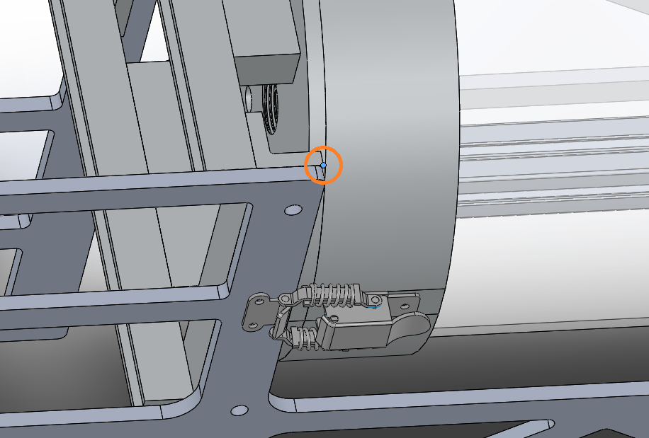
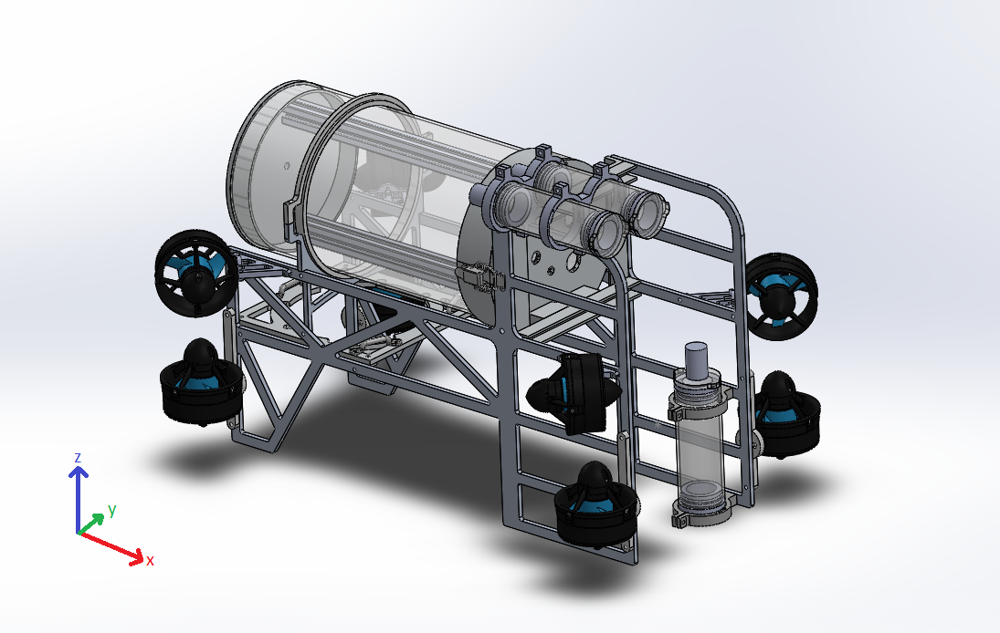

# Static Transforms

The `static_transforms.launch` file publishes the static transforms that define key parts of the robot using the ROS [static_transform_publisher](http://wiki.ros.org/static_transform_publisher). These are used to calculate the robot state based on sensor data, in addition to other uses. Measurements are xyz in meters and ypr in radians. See link for specific syntax and more details.

Most recently updated on 2/29/2020 for Cthulhu 2.0.

## Transform Tree

```md
            odom
              |
            d |
              |
          base_link
              |
            s |
              |
         corner_link
        /     |      \
     s /    s |     s \
      /       |        \
dvl_link  cameras_link  imu_link
```

`s` = static transform (based on fixed geometry), `d` = dynamic transform (updates as the robot moves)

## Transform explanation

* `odom` - world frame
* `base_link` - robot frame, measured to center of the robot (center is the center of the four upper vectored thrusters)
* `corner_link` - a particular corner on the frame of the robot, arbitrarily chosen, but easier to point to than the elusive center of the robot. See picture. 
* `dvl_link` - measured to bottom center point of Teledyne Workhorse Navigator 1200 DVL (might need to be a different point, look at documentation)
* `cameras_link` - measured to a location on the cameras, TBD exactly where that location is
* `imu_link` - measured to the center of the IMU

## Robot frame orientation

